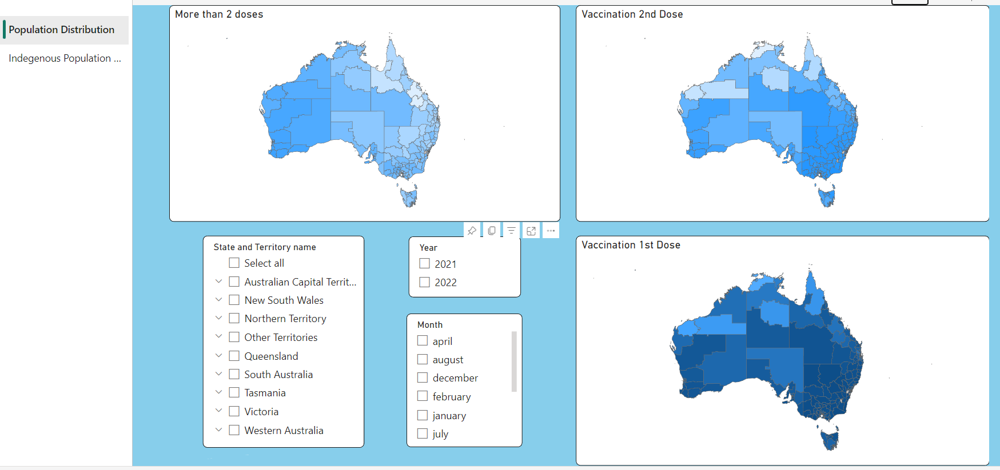

# Covid 19 Vaxboard

**Note : This dashboard was presented as a group project for coursework at RMIT, Melbourne.** 

- Delivered a fully functional dashboard for covid-19 vaccine distribution data across all the states in Australia using PowerBI.
- Integrated datasets to obtain a meaningful dashboard.
- Used PowerBI visuals for maps to visualize geographical data.
- Added different data slicers and selectors to visualize required data.

Check out the video :

[Link to Video](https://youtu.be/Jniyst3tSiA)
